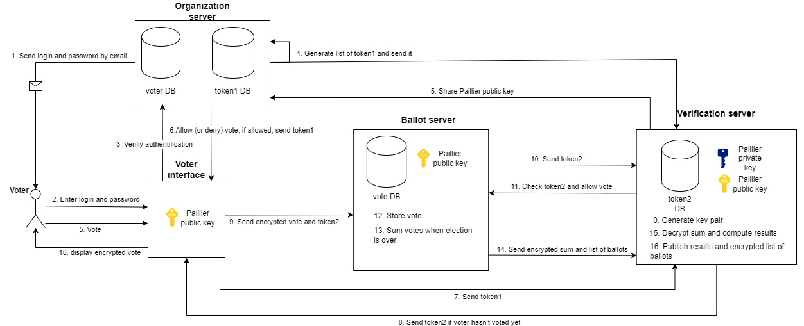

# Electronic voting system based on tokens and Paillier cryptosystem

Paper ballot voting has been the standard method regarding elections, being used in most countries around the world. Yet voting by paper ballot is not without its limitations: paper ballots can be lost, misread or miscounted leading to inaccurate vote counts and disputes over the election results. 

Electronic voting systems offer safer, more efficient, and faster methods of managing election. They can also be more accessible since they don't necessarily require the voter to go to  a polling station, allowing the voter to cast a ballot from anywhere. However when creating an electronic voting system, one needs to be extremely cautious about safety and confidentiality. If not, the system could be easily attacked, resulting in a leak of private information or even in malicious tampering of results.

We propose a Paillier cryptosystem and token based architecture to solve various issues that appear in the voting process.
Our implementation simply consists of a terminal interface to allow the user to cast a vote, we would like to include a web interface in the future to be more accessible. We would also recommand adding a timeout that prevents voters from casting a ballot after the end of the election, and then automatically induces the computation and publication of the results.

## Architecture Diagram


Our system is composed of 3 main sub-systems. 

Firstly, the verification server generates the pair of Paillier cryptographic keys that will be used for an election. It will also retrieve the encrypted results, decrypt them and publish them. It is the only part of the system that contains the private key that allows to decrypt any message encrypted with the public key.

Then, the organization server contains a voter database containing all information relating to the voters? We chose to only save their name and surname, their email address and their login and password.

Lastly, the ballot server receives the encrypted votes, stores them and adds them to an encrypted sum using Paillier cryptosystem. We use the latter to add encrypted numbers together, resulting in an encrypted sum that can only be decrypted using a private key.

## Installation and Usage

Use the package manager pip to install the different libraries.
```bash
pip install numpy
pip install paillierlib
pip install pcryptodome
pip install cryptography
pip install gmpy2==2.1.0rc1
```
To create a key pair for one election, run: 
```bash
python Serveur_Verif/Init_key.py
```

To create a database for an election, run:
```bash
python Serveur_Orga/AcreationDB.py
```
Once the previous steps are done, voters can access their interface and then vote using this line of command : 
```bash
python Interface_Client/voterLogin.py
```
When the election is over, the organisation can get the results using:
```bash
python Serveur_Verif/resultats.py
```

## Context

This project was conducted as a part of the PIR course (Projet d'Initiation à la Recherche - Introduction to Research Project) at National Institure of Applied Sciences, Toulouse (France). We worked on this subject as a team of six fourth-year engineering students specialized in computer science, tutored by two professors.


